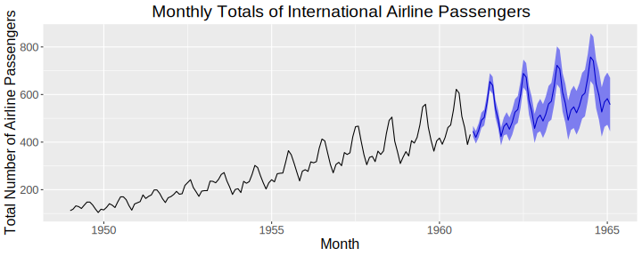
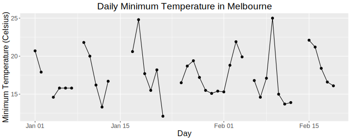
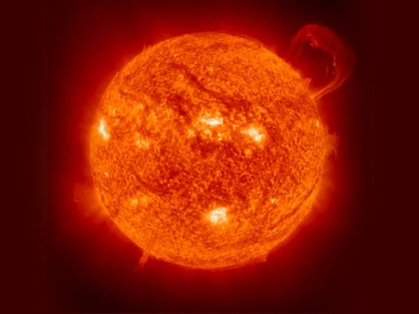
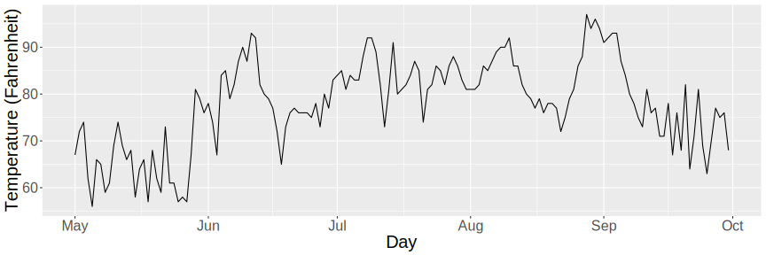
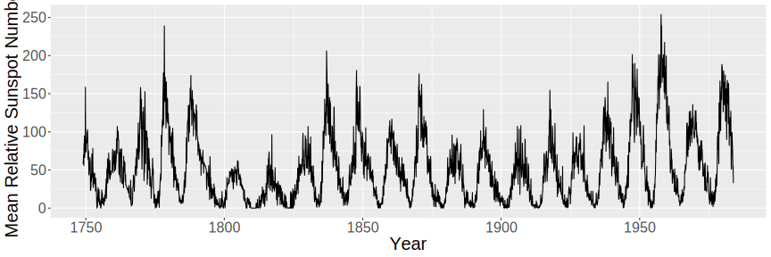
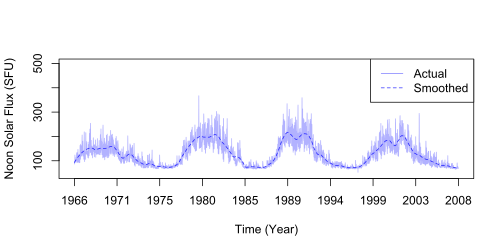
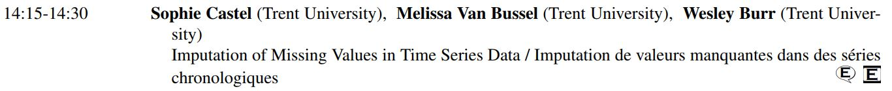

```{r setup, include=FALSE}
options(htmltools.dir.version = FALSE, cache = TRUE)
```

# Recall... 

A **time series** is a sequence of observations, $\{X_t\}$, one taken at each time $t$, and arranged in chronological order. 

```{r, echo = FALSE, include = FALSE, fig.height = 4, fig.width = 10}
library(forecast)
library(ggplot2)
d.arima <- auto.arima(AirPassengers)
d.forecast <- forecast(d.arima, level = c(95), h = 50)
airline <- autoplot(d.forecast) + 
  ggtitle("Monthly Totals of International Airline Passengers") + 
  xlab("Month") + 
  ylab("Total Number of Airline Passengers") +
  theme(plot.title = element_text(hjust = 0.5),
        text = element_text(size = 16))
ggsave(file = "airline.svg", plot = airline)
```

<center></center>

There are many methods available for modelling time series...

---

# Missing Observations 

...however, most methods require that the series is **contiguous** (no missing observations). 

```{r, echo=FALSE, fig.align="center", fig.width = 10, fig.height = 4, warning = FALSE, message=FALSE}
library(ggplot2)
mintemp <- read.csv(paste0(getwd(), "/mintemperature.csv"),
                    stringsAsFactors = FALSE)
colnames(mintemp) <- c("date", "temp")
mintemp$date <- as.Date(mintemp$date, "%m/%d/%Y")
mintemp$temp <- as.numeric(mintemp$temp)
mintemp <- mintemp[1:50,]
n <- length(mintemp$date)
missing_indices <- sample(1:n, 0.20*n, replace = FALSE)
mintemp$temp[missing_indices] <- NA
mintemp_plot <- qplot(date, temp, data = mintemp) +
  geom_line() + 
  xlab("Day") + 
  ylab("Minimum Temperature (Celsius)") + 
  ggtitle("Daily Minimum Temperature in Melbourne") + 
  theme(plot.title = element_text(hjust = 0.5),
        text = element_text(size = 16))
ggsave(file = "mintemp.svg", plot = mintemp_plot)
```

<center></center>

Thus, missing observations must be **imputed** (interpolated). 

---

background-image: url(lightning.jpg)
background-size: 300px
background-position: 78% 18%

# Why?

There are a number of reasons why a time series might have missing observations. 

- Weekends or holidays

- Equipment failure

- Environmental constraints 

- Transcription errors or incorrect data

</br>

<center></center>

---

# Goals of the Project

Project completed for an undergraduate course, MATH4800H

- Research a variety of time series interpolation algorithms

--

- Evaluate their performances on a number of real-world datasets

--

- Use multiple performance criteria 

```{r, echo = FALSE}
algorithm_names <- c("Nearest Neighbor",
                     "Linear Interpolation", 
                     "Natural Cubic Spline",
                     "FMM Cubic Spline", 
                     "Hermite Cubic Spline",
                     "Stineman Interpolation",
                     "Kalman - ARIMA",
                     "Kalman - StructTS",
                     "Last Observation Carried Forward",
                     "Next Observation Carried Backward", 
                     "Simple Moving Average", 
                     "Linear Weighted Moving Average",
                     "Exponential Weighted Moving Average",
                     "Replace with Mean",
                     "Replace with Median", 
                     "Replace with Mode",
                     "Replace with Random",
                     "Hybrid Wiener Interpolator")
```

--

```{r}
head(algorithm_names, n = 12)
```

---
class: inverse, center, middle

# Datasets Used

---

# What kind of data were used?

- All time series used were real-world datasets (**not** simulated data)

- Non-stationary series

- Desirable to use series of varying length and spacing between observations 

- Some of these will likely be familiar to some of you

</br></br>

<center></center>

---

# First Dataset

- Daily measurements of temperature (in Fahrenheit) in New York, May to September of 1973

- (The `temperature` variable from the `airquality` dataset in `R`)

```{r, echo = FALSE, include = FALSE, fig.height = 4, fig.width = 12}
airquality_temp <- airquality$Temp
airquality_date <- as.Date(paste("1973-", airquality$Month, 
                         "-", airquality$Day, sep = ""))
airqualitydf <- data.frame(airquality_temp, airquality_date)
airqualityplot <- ggplot(data = airqualitydf, aes(x = airquality_date, y = airquality_temp)) +
  geom_line() +
  ylab("Temperature (Fahrenheit)") + 
  xlab("Day") +
  theme(text = element_text(size = 20))
ggsave(file = "airquality.svg", plot = airqualityplot)
```

</br> </br>
<center></center>

---

# Second Dataset 

- Monthly mean relative sunspot numbers from 1749 to 1983 

- (The `sunspots` dataset in `R`)

```{r, echo = FALSE, include=FALSE, fig.height = 4, fig.width=12, message=FALSE}
sunspotsdf <- data.frame(numspots = sunspots, 
                         date = time(sunspots))
sunspotsplot <- ggplot(data = sunspotsdf, aes(x = date, 
                                              y = numspots)) +
  geom_line() +
  xlab("Year") + 
  ylab("Mean Relative Sunspot Number") +
  theme(text = element_text(size = 20))
ggsave(file = "sunspots.svg", plot = sunspotsplot)
```

</br> </br>
<center></center>

---

# Third Dataset 

- Daily noon solar flux measurements from Penticton, British Columbia

- (The `PentOrig` variable from the `flux` dataset in the `tsinterp` package in  `R`)

```{r, echo = FALSE, include=FALSE, fig.height = 4, fig.width=12, message=FALSE}
library(tsinterp)
data(flux)
df <- data.frame("pent" = flux$PentOrig,
                "index" = 1:length(flux$PentOrig))
smoothed_pent <- loess(pent ~ index, data = df, span = 0.05)
smoothed_pent <- predict(smoothed_pent)
svg("flux.svg", width = 7, height = 3.5)
plot(flux$PentOrig, 
     main = "", 
     xlab = "Time (Year)", 
     ylab = "Noon Solar Flux (SFU)", 
     type = "l",
     xaxt = "n",
     col = rgb(0, 0, 1, 0.3),
     ylim = c(45, 500))
axis(side = 1, at = seq(0, 15251, length.out = 10),
     labels = round(seq(1966, 2008, length.out = 10)))
lines(smoothed_pent, col = rgb(0, 0, 1, 0.8), lty = 2)
legend("topright",
       legend = c("Actual", 
                  "Smoothed"),
       col = c(rgb(0, 0, 1, 0.5), 
               rgb(0, 0, 1, 0.8)),
       lty = c(1, 2))
dev.off()
```

</br>
<center></center>

---
class: inverse, center, middle

# The Experiment

---
# What was done? 

Wrote an `R` script to do the following: 

- Randomly impose gaps on each of the datasets (5%, 10%, 15%, 20%, 25%)

- Use 18 different interpolation algorithms to fill in the gaps

  - Including algorithms from the `R` packages `zoo`, `forecast`, `imputeTS`, and `tsinterp`

- Evaluate the performance of each algorithm using 17 different performance criteria

- Create tables summarizing the algorithms which performed the best and the worst (for each gap level, dataset, and performance criteria)

---
# Results

- There wasn't one overall "winner", but in most cases, the best performing algorithms were: 
  - Exponential Weighted Moving Averages
  - Kalman Filters
  - Cubic Splines

- The algorithms which performed well performed **very** well, and very comparably. For example: a subset of the 20% gap level results for $r$:  

```{r, echo = FALSE, warning=FALSE, message=FALSE}
library(knitr)
library(kableExtra)
library(dplyr)
load(paste(getwd(), "/Performances/performance_matrices_0.20.RDa", sep = ""))
my_table <- round(performance_matrices_0.20[[1]][c(3:5, 7:8, 12:13, 18), ],8)
colnames(my_table) <- c("airquality", "sunspots", "flux")
rownames(my_table)[6:7] <- c("Linear Weighted MA", "Exponential Weighted MA")
my_table %>% 
  mutate(
    algorithm = row.names(.),
    airquality = cell_spec(airquality, 
                           color = ifelse(airquality > 0.9815, "#32c140", 
                                          ifelse(airquality < 0.9647, 
                                                 "#e5675b", "#316c77")),
                           bold = ifelse(airquality >0.9815 | airquality < 0.9647, TRUE, FALSE)), 
    sunspots = cell_spec(sunspots, 
                         color = ifelse(sunspots > 0.9905, "#32c140", 
                                        ifelse(sunspots < 0.9850313, 
                                               "#e5675b", "#316c77")),
                         bold = ifelse(sunspots > 0.9905 | sunspots < 0.9850313,
                         TRUE, FALSE)), 
    flux = cell_spec(flux,
                     color = ifelse(flux > 0.999273, "#32c140", 
                                    ifelse(flux < 0.9984, 
                                           "#e5675b", "#316c77")), 
                     bold = ifelse(flux > 0.999273 | flux < 0.9984, 
                                   TRUE, FALSE))
  ) %>% 
  select(algorithm, airquality, sunspots, flux) %>% 
kable(head(performance_matrices_0.20[[1]]), format = "html", 
      escape = FALSE, align = c("lccc")) %>% 
  kable_styling(c("striped", "condensed"), full_width = FALSE, font_size = 16) %>% 
  column_spec(1, bold = TRUE, width = "17em") %>% 
  column_spec(2, width = "6em") %>% 
  column_spec(3, width = "6em") %>% 
  column_spec(4, width = "6em") %>% 
  row_spec(0, bold = TRUE, color = "white", background = "#316c77")
```

---
# Next Steps 

- Expand analysis to include more datasets
  
  - Will require a significant increase in computational power

- Experiment with varying gap lengths and gap selection methods 

- Include datasets from a wide variety of fields

- Create recommendations for which algorithm to use based on the type of data 

</br> 

**Want to learn more? Check out Sophie Castel's presentation on Monday!**

<center></center>

---
# References

1. Mathieu Lepot, Jean-Baptiste Aubin, and Francois H.L.R. Clemens. Interpolation in Time Series: An Introductive Overview of Existing Methods, Their Performance and Uncertainty Assessment. Water 2017, 9(10), 796.

2. Wesley S. Burr. Air Pollution and Health: Time Series Tools and Analysis. Queen's University, PhD thesis. 2012.

3. Wesley S. Burr (2012). `tsinterp`: A Time Series Interpolation Package for `R`. R Package.

---

# Thank You

 <a style="color:black; text-decoration:none; position:absolute; top:160px; left:200px; font-size:32px; font-weight:bold;" href="mailto:melissavanbussel@trentu.ca"> melissavanbussel@trentu.ca</a>

 <a style="color:black; text-decoration:none; position:absolute; top:310px; left:200px; font-size:32px; font-weight:bold;" href="https://www.linkedin.com/in/melissavanbussel">linkedin.com/in/melissavanbussel</a>

 <a style="color:black; text-decoration:none; position:absolute; top:460px; left:200px; font-size:32px; font-weight:bold;" href="https://www.github.com/melissavanbussel">github.com/melissavanbussel</a>

<p style="position:absolute; top:560px; left:50px;">
Slides created via the R package <a href="https://github.com/yihui/xaringan">xaringan</a>. Slides and accompanying files are available on <a href="https://github.com/melissavanbussel">GitHub</a>.
</p>


